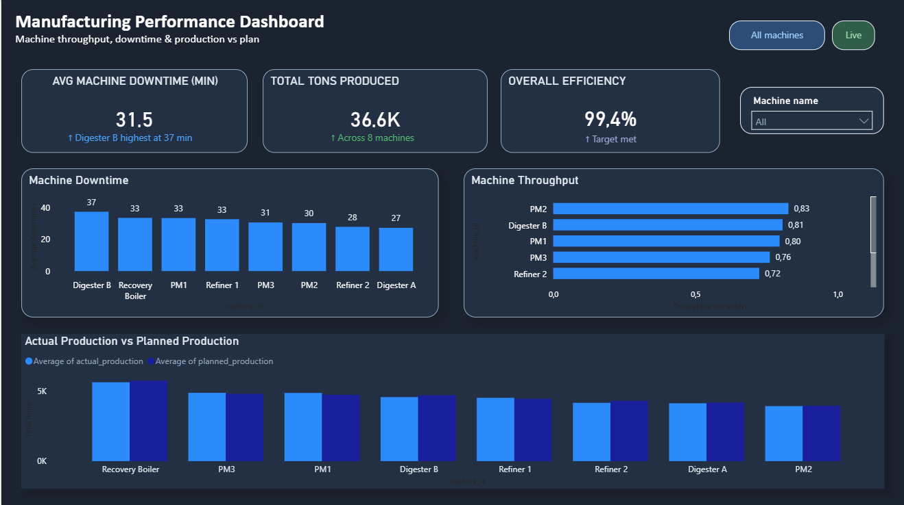
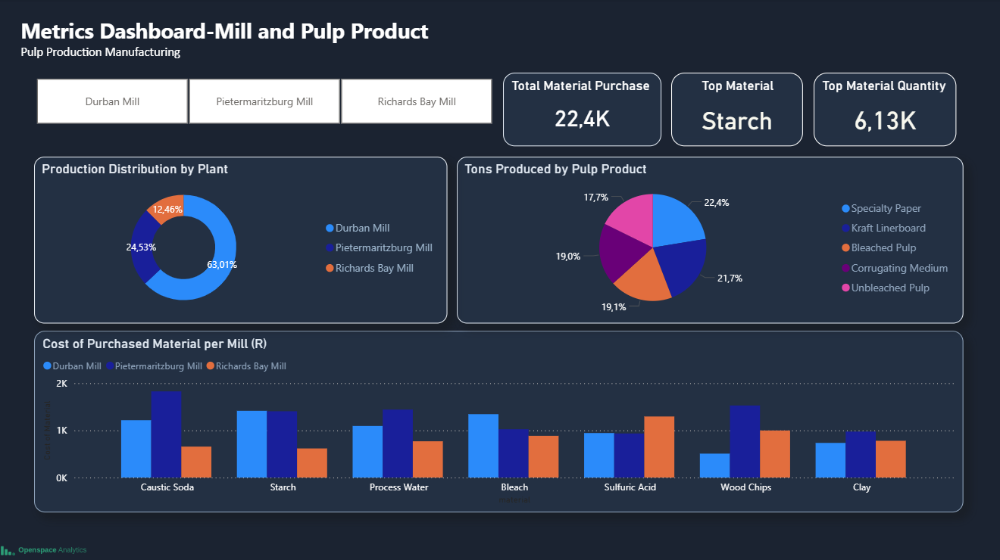
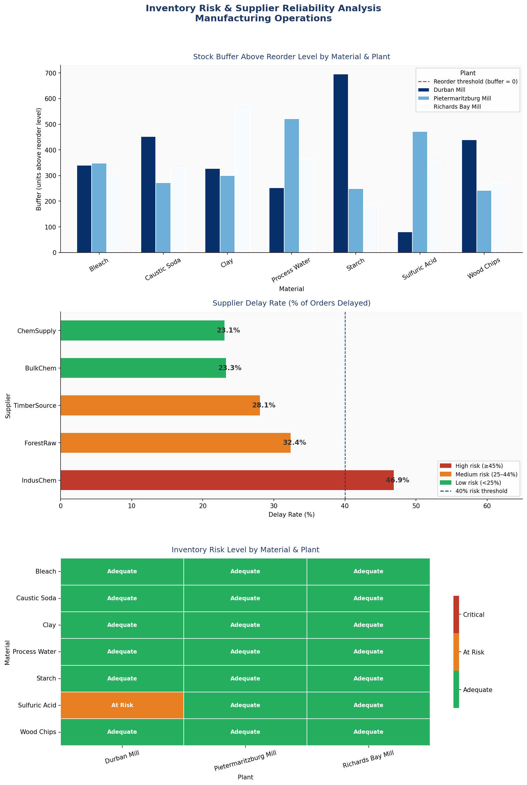

# Manufacturing & Production Analytics


---

## Project overview

This project demonstrates a complete analytics pipeline
built for a pulp manufacturing operation. It covers
production performance, machine efficiency, downtime
analysis, and material cost intelligence across three
production mills.

The pipeline moves from raw operational data through
structured SQL views to a live Power BI dashboard —
the same architecture we deploy for manufacturing
clients connecting to their ERP or production systems.

**Pipeline:**
Raw data → PostgreSQL → SQL views → Power BI dashboard

---

## Business context

Production managers in pulp and paper manufacturing
deal with the same core reporting challenges:

- Planned vs actual production targets are tracked
  in spreadsheets, not dashboards
- Machine downtime is recorded but rarely analysed
  for patterns
- Material costs are visible in accounting but not
  connected to production output

This project answers the questions those managers
actually ask — built on a dataset representing three
South African pulp mills.

---

## The dataset

The dataset represents pulp production operations
across three mills:

- Durban Mill
- Pietermaritzburg Mill
- Richards Bay Mill

**Three data domains are covered:**

Machine performance
- Machine ID and plant assignment
- Actual vs planned production output
- Machine throughput rates
- Downtime in minutes per production run

Production output
- Total tons produced per machine and per mill
- Production distribution across facilities

Materials and procurement
- Raw materials used in production
- Material purchasing costs by plant
- Spending patterns across mills

---

## SQL — data preparation layer

Raw tables were loaded into PostgreSQL. Rather than
querying raw data directly in Power BI, we built
analytical views that aggregate and clean the data
first. This separation keeps the dashboard logic clean
and makes the pipeline maintainable.

**View structure:**

```sql
CREATE VIEW analytics.vw_machine_summary AS
SELECT
machine_id,
plant,
SUM(actual_production) AS actual_production,
SUM(planned_production) AS planned_production,
AVG(downtime_minutes) AS avg_downtime_minutes,
AVG(throughput) AS avg_throughput
FROM raw_data.machine_performance
GROUP BY machine_id, plant;
```

Additional views cover production summary by product,
machine downtime analysis, and combined machine
performance combining throughput and downtime in a
single queryable layer.

Full SQL scripts are in the `/sql` folder.

---

## Power BI dashboard

Two dashboard pages were built on top of the SQL views.

**Page 1 — Manufacturing performance**

Focuses on machine-level production and operational
efficiency. Key visuals include:

- Average machine downtime across all machines
- Best performing machine by throughput
- Total tons produced (YTD)
- Actual vs planned production by machine
- Production distribution by mill

This page gives production managers an immediate view
of which machines are performing and where operational
issues are concentrated.



**Page 2 — Mill and material analysis**

Focuses on cost intelligence at the mill level. Key
visuals include:

- Total material cost by plant
- Cost breakdown by material type
- Highest cost materials by spend
- Spending variation across mills

This connects production volume to input costs —
answering the question of whether high-output mills
are also cost-efficient.



**DAX measure — production efficiency**

A DAX measure was created to track production
efficiency as a calculated metric across the dashboard:
Production efficiency =

DIVIDE(

SUM(vw_machine_summary[actual_production]),

SUM(vw_machine_summary[planned_production])

)

This gives management a single percentage that
immediately communicates whether the operation is
meeting its production plan.

---

## Key findings from the analysis

The dashboard surfaces several patterns relevant to
production management decisions:

- Machine throughput varies significantly across the
  fleet — the highest performing machines outproduce
  the lowest by a measurable margin
- Downtime is not evenly distributed — certain machines
  account for a disproportionate share of lost production
  time and warrant closer maintenance attention
- Durban Mill contributes the largest share of total
  production output across the three facilities
- A small number of raw materials account for the
  majority of procurement spend
- Material spending patterns differ between mills in
  ways that are not explained by production volume alone

---

## Python analysis — inventory risk and supplier reliability

**Business question:**
Which materials are at risk of running out, and are
the suppliers for those materials reliable enough to
restock them in time?

**Approach:**

Two factors were combined to calculate procurement risk:

1. Stock buffer — how close each material is to its
   reorder level
2. Supplier delay rate — calculated per supplier AND
   per material combination, not averaged across all
   materials

The second point is critical. A supplier may be
reliable for Wood Chips but consistently delay Starch
deliveries. An overall average delay rate would hide
that. Our approach calculates delay rates at the
material and supplier level before rolling up to a
final risk score.

A material is only flagged as a procurement risk when
both conditions are true simultaneously — low stock
buffer AND unreliable supply for that specific material.

**Findings:**

- 20 of 21 material and plant combinations have
  adequate stock levels
- Sulfuric Acid at Durban Mill is the only confirmed
  procurement risk — buffer of 80 units above reorder
  level with a supplier delay rate of 33.5%
- IndusChem has the highest overall delay rate at 46.9%
  and delays Sulfuric Acid specifically 80% of the time
- BulkChem and ChemSupply are the most reliable
  suppliers at approximately 23% delay rate

**Output — three charts produced:**

1. Stock buffer by material and plant — grouped bar
   chart with reorder threshold line
2. Supplier delay rate by supplier — horizontal bar
   chart colour coded by risk level
3. Inventory risk heatmap — grid showing risk level
   per material and plant combination



Full script with line-by-line comments is in
`/python/inventory_risk_analysis.py`

---

## Tools used

| Tool | Purpose |
|---|---|
| PostgreSQL | Data storage and SQL view layer |
| Power BI | Dashboard and visualisation |
| DAX | Production efficiency measure |
| Python (pandas) | Data loading, cleaning, grouping |
| Python (matplotlib) | Chart drawing and formatting |
| Python (seaborn) | Heatmap visualisation |
| GitHub | Version control and documentation |

---

## Repository structure

manufacturing-reporting-analytics/

├── sql/

│   └── analytics_views_summary.sql

├── python/

│   └── inventory_risk_analysis.py

├── screenshots/

│   ├── Dashboard1.png

│   ├── Dashboard2.png

│   └── inventory_risk_analysis.png

└── README.md


## Dashboard update — date filter and star schema

After the initial dashboard was built, I added a month-level date slicer
so production data can be filtered by time period directly in Power BI.

This required changes at both the SQL and data model level.

---

### What changed in SQL

All existing analytics views were updated to include a `production_month`
column. This is derived from `start_time` in the production orders table
using `DATE_TRUNC('month', start_time)::DATE`, which truncates each
timestamp to the first day of its month.

For the purchases view, `order_date` was used instead of `start_time`
because purchase orders use a date field rather than a timestamp.

The updated views are in `sql/analytics_views_date_filter.sql`.

---

### Dimension views — star schema

Two new dimension views were created to act as the one side of a
star schema in Power BI.

**date_dim**
One unique row per production month derived from actual data in
production orders. Only months with real production activity appear.
Fields: `production_month`, `year`, `month_number`, `month_label`

**machine_dim**
One unique row per machine pulled from the machines reference table.
Fields: `machine_id`, `plant`, `machine_type`, `commission_year`

These two views sit at the centre of the data model. All fact views
connect to them via `production_month` and `machine_id` respectively.

---

### Power BI data model

The model follows a star schema pattern:

```
date_dim    (1) ──── (*) all fact views
machine_dim (1) ──── (*) all fact views
```

All relationships are set to cross-filter in both directions so a
selection on either dimension table filters all connected visuals
simultaneously.

---

### Slicers added

A month range slicer was added to the Manufacturing Performance Dashboard.
It uses `production_month` from `date_dim` and is formatted as a
between-style date range picker.

The existing machine name slicer was reconnected to `machine_id` from
`machine_dim` so it filters through the star schema correctly.

Both slicers work together — selecting a machine and a date range
filters all KPI cards and charts on the page at the same time.

---

### DAX measure update

The production efficiency measure was updated to reflect the restructured
views:

```dax
Production Efficiency =
DIVIDE(
    SUM('analytics vw_machine_summary'[actual_production]),
    SUM('analytics vw_machine_summary'[planned_production])
)
```

The measure is formatted as a percentage in Power BI and displayed
on the Overall Efficiency KPI card.


